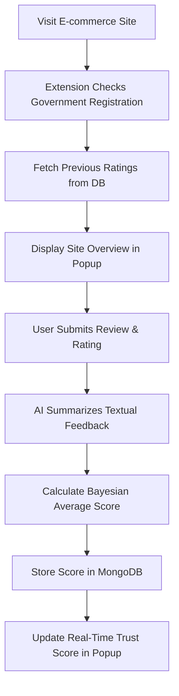

# E-Commerce Trustworthiness Chrome Extension 🔍🛒

A **React + TypeScript + Tailwind CSS + MongoDB** powered **Chrome extension** designed to evaluate the trustworthiness of e-commerce websites by combining **user-submitted reviews** with **government registration verification**. It uses **OpenAI sentiment processing** to analyze textual feedback and displays real-time safety indicators.


## 📌 Overview

This Chrome extension provides a **trust score** for any visited e-commerce site based on:

* Verified **government registration**.
* **User ratings** and **reviews**.
* **Bayesian Average Algorithm**-based scoring for accuracy.
* AI-generated review summaries from **OpenAI (LLMA V3)**.

The extension offers an intuitive, two-slide interface:

1. **Summary View:** Displays the overall trust score, top user feedback, and recent reviews.
2. **Review Submission View:** Allows users to submit ratings, select feedback categories, and add textual reviews.


## 🛠 Features & Functionality

### **Section 1 – Site Overview**

* Displays **site logo** and **URL**.
* **5-star dynamic rating bar** with color-coded visual feedback:

  * **0.0 – 2.6:** 🔴 Red (low trust)
  * **2.7 – 3.7:** 🟡 Yellow (medium trust)
  * **3.8 – 5.0:** 🟢 Green (high trust)
* **Government registration status** with a bold, verified badge.
* Optional **PhishTank API** integration to detect phishing links.
* **Dynamic confidence bar** with color gradients that fill based on rating.


### **Section 2 – User Reviews**

* **Three review categories**:

  1. **Product Quality** (e.g., Good Quality, Poor Quality)
  2. **Service Satisfaction** (e.g., Fast Delivery, Poor Customer Support)
  3. **Platform Experience** (e.g., Easy to Use, Difficult Navigation)
* **Multi-checkbox rating system** with predefined options (80%) and AI-generated dynamic options (20%) from textual reviews.
* **Text input field** for users to share experiences in any language (Bangla, English, Banglish).
* AI summarization of reviews into category-based keywords.


### **Section 3 – Top Selected Options**

* Displays **top five most selected feedback options** with the number of reviewers for each.
* Interactive button-style layout for easy readability.


### **Section 4 – Recent Textual Reviews**

* Shows **recently submitted reviews**.
* Option to **view all reviews together**.
* Clean UI with dividers for better separation between reviews.


## 📊 Main Functionality

* **Scoring System:**

  * Base score assigned for each selected feedback option.
  * Additional score based on **government registration** status.
  * Bayesian Average Algorithm combines:

    * User ratings (weighted)
    * Government verification
* **Result Storage:**

  * Overall rating stored in MongoDB for each site.
  * Ratings retrieved in real-time when revisiting the site.


## 🖥 Tech Stack

* **Frontend:** React, TypeScript, Tailwind CSS
* **Backend:** Node.js, Express
* **Database:** MongoDB
* **AI Processing:** OpenAI LLMA V3 for review summarization
* **Optional APIs:** PhishTank for phishing detection


## 📐 Workflow Diagram



---

## 🖼 UI Preview Section

*(Replace with actual screenshots or mockups)*

```


```


## 📥 Installation & Setup

### 1️⃣ Clone the Repository

```bash
git clone https://github.com/<your-username>/ecommerce-trust-extension.git
cd ecommerce-trust-extension
```

### 2️⃣ Install Dependencies

```bash
npm install
```

### 3️⃣ Build the Extension

```bash
npm run build
```

### 4️⃣ Load into Chrome

* Open `chrome://extensions/`
* Enable **Developer Mode**
* Click **Load unpacked** and select the `build` directory


## 🔮 Future Enhancements

* Add **multi-language sentiment analysis**.
* Implement **phishing detection alerts**.
* Enable **real-time update notifications** when ratings change.


## 👨‍💻 Author

**Jaawad Tashick**
*Computer Science Graduate*


